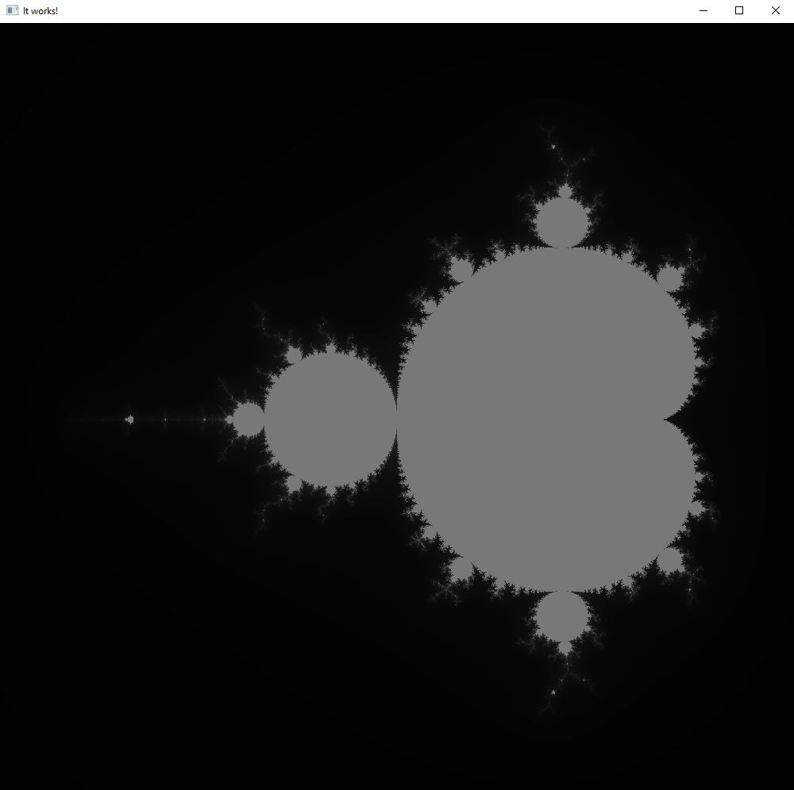
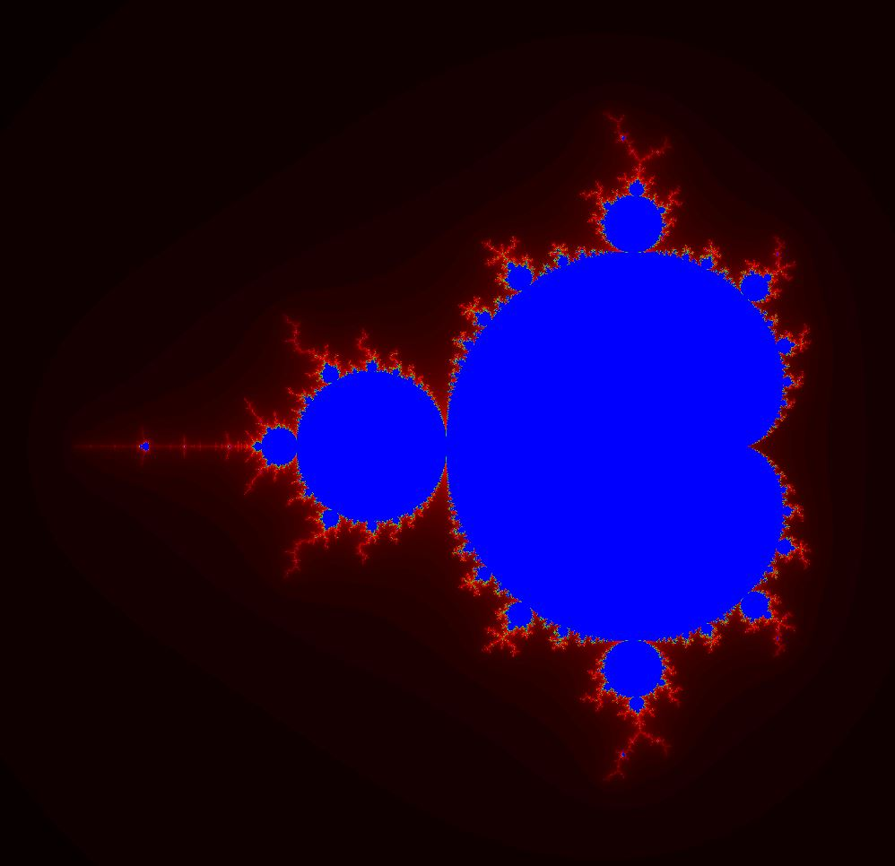
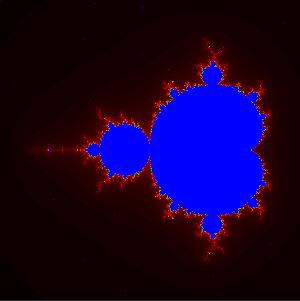
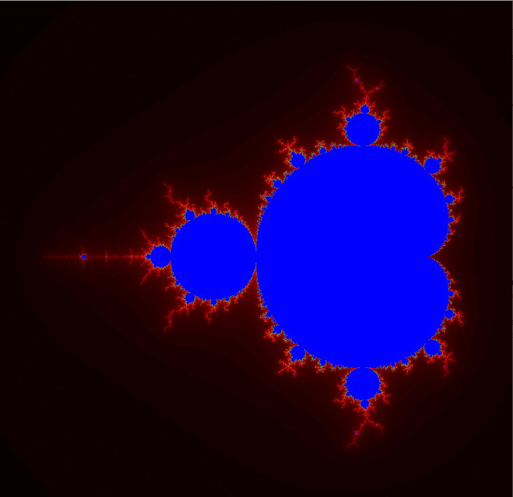
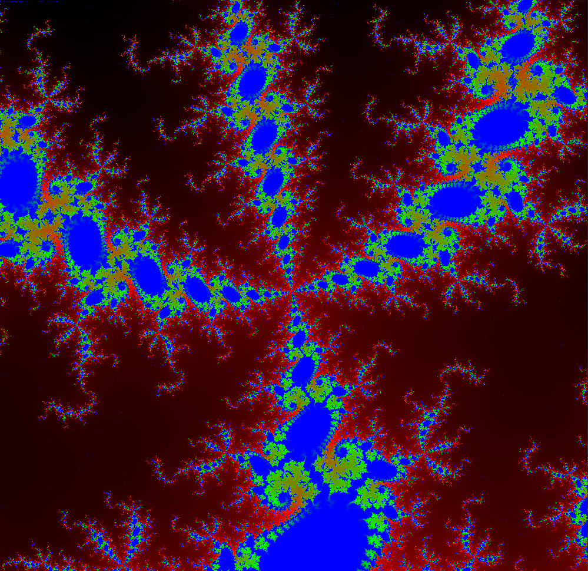

# The Mandelbot Set
The goal of this part is threefold.
 
1. First I want to write a version of the Mandelbrot set in C++. It should be possible to display it and it should be colored.
2. The second part is copying the code and transforming it to a version that can be run using CUDA. It is 
supposed  to utilize CUDA to speed up the calculations so as not to cause any waiting times.
3. After that I reached the important goals, but want to make it a bit more interactive by allowing the user to zoom in. This is also a great test for how performant my CUDA code is, since delays become quite noticable when zooming.

## Progress
### Goal #1
The Mandelbrot set is implemented and can be run using SFML and the Codeblocks IDE (or with a little more effort manually).
The first result was this gray image.

 
 
 
Then I (primitively) interpolated the color depending on how quickly a point escaped from the set and got this.
 
 

### Goal #2
Since CUDA is (on Windows) only compatible with VisualC++, which I conveniently ignored, I had some trouble matching my TDM or MinGW compiled SFML code with CUDA code.
 
Since I am using VS 19 I had to build SFML locally and then included it in a VS project to run a SFML code sample. Then I updated CUDA to 10.1 update 2, so I have a VS CUDA template and now I am finally able to create CUDA project in VS code. Now all I need to do is combine SFML and CUDA in a project to get going with goal #2.
 
I now have a working version of calculating the mandelbrot set with CUDA, even though it is not yet running in parallel. This is the first result.

 
 
I am having a few problems with CUDA throwing an exception when using more than ~300\*300points, even though the code logic is basically the same as before and have no idea why yet.
 
Thanks to StackOverflow I found out that the exception occurs because the program hits a [WDDM TDR](https://docs.microsoft.com/en-us/windows-hardware/drivers/display/timeout-detection-and-recovery) event. In other words the program took too long to execute and as I understand it Windows resets parts of the graphics stack (See the link).
 
This of course interferes with the program. Once I added the grid-stride loop described in the CUDA introduction and let it run on a lot more threads the program executed quickly enough to not run into this event.
Here is the result, now again 1000x1000 pixels. (Approximately since I simply cut part of the screen)

Therefore Goal #2 is now complete.

### Goal #3
Done, it is now possible to zoom in and out, however after several zooms it starts to slow down considerably, probably since I increase the iterations to keep
a nice detail.
 
Maybe I will invest some more time into this some other day (same goes for improved color calculations), but for now I am finished with this project.
 
And finally, here a cool zoom into the mandelbrot set :)

## Resources
In this project I use SFML and Nvidia Cuda.
I found the SFML setup (on Windows) rather troublesome, this [tutorial](https://www.youtube.com/watch?v=fcZFaiGFIMA) really helped me out.
Also pay attention to the compiler you are using matching the one specified by SFML.
